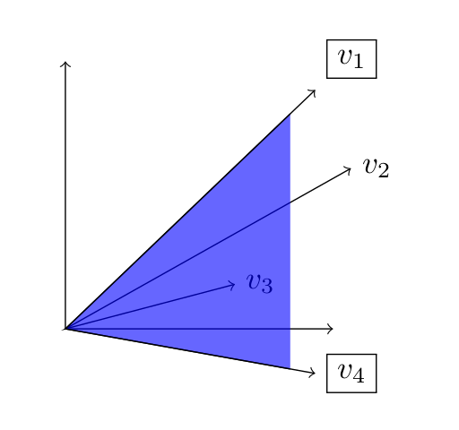
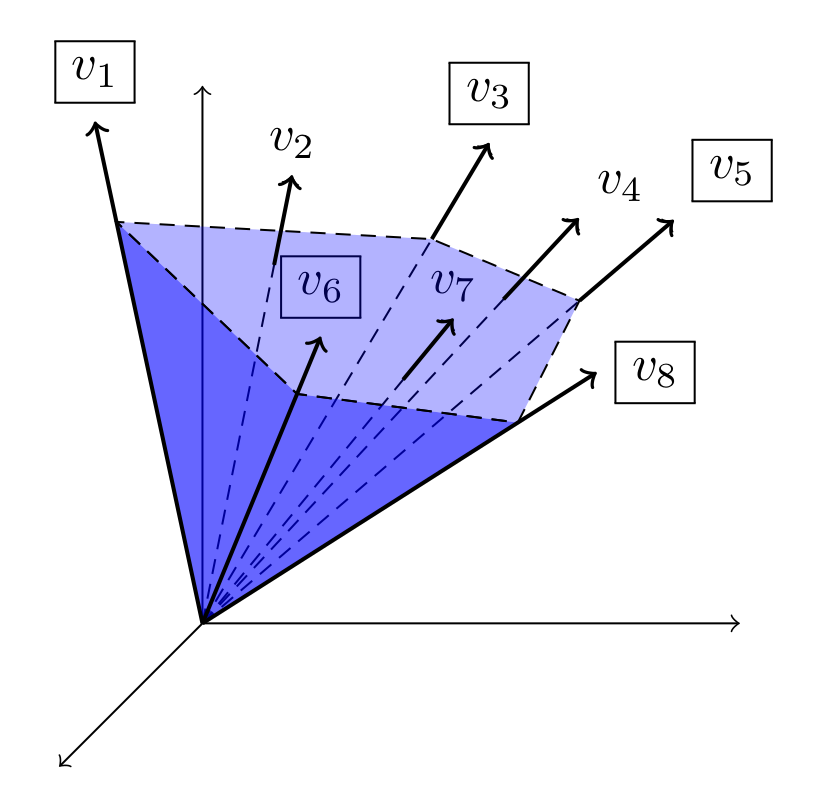
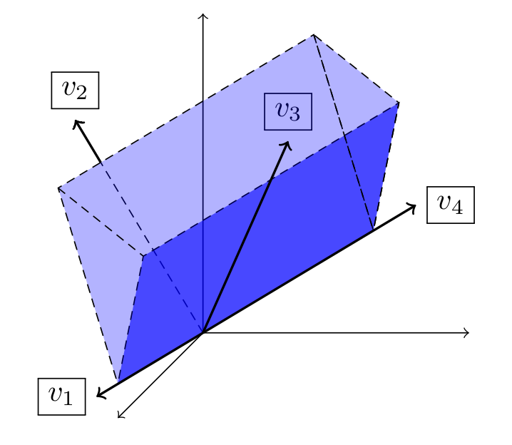

# Classification of convex cones
The program classifies the convex cone generated by input vectors   in the vector space  . This was my final project of the module "Computational Tools for Mathematics" for the Bachelor's Degree in Mathematics at the Autonomous University of Barcelona.

## Theoretical classification of convex cones in 
Let  be a convex cone in , i.e. a subset  that is closed under linear combinations with non-negative coefficients.  can be classified as follows:

 - **Cone {0}**, if  = 
 - **Ray**, if  dim() = 1  and  is generated by the conic combination of one vector.
 - **Line**, if dim() = 1 and  is generated by two vectors.
 - **Plane angle**, a cone with the vertex at the origin of the space , and generated by two vectors which form an angle  such that 0 <  < . An example of plane angle generated by  and  is shown in the following figure:
 

    

 - **Half-plane**
 - **Plane**, i.e. 
 - **Polyhedral cone**, also called _solid angle_. An example of polyhedral cone generated by  and  is shown in the following figure:

    

 - **Solid dihedral angle**, a cone with the shape of an infinite wedge. An example of solid dihedral angle generated by  and  is shown in the following figure:

    

 - **Half-space**
 - **Space**, i.e. 

 
***
Project in progress
